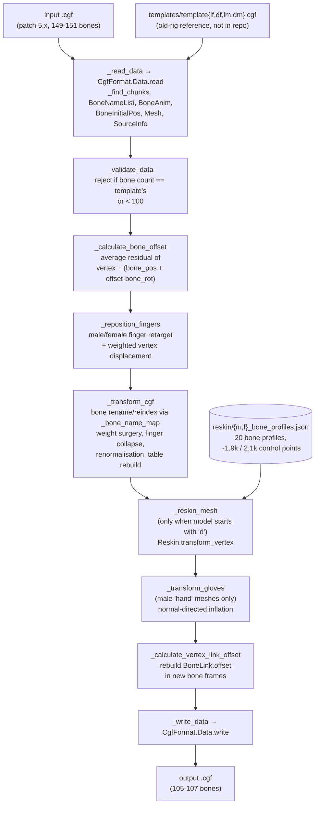

# transform-cgf

`transform-cgf` converts Aion character meshes (CryEngine `.cgf` geometry files) from the skeleton and skinning layout introduced in game patch 5.x back to the layout used by earlier patches. Newer character assets carry a larger skeleton (151 bones for female models, 149 for male models) than the old one (107 / 105), use five finger chains per hand instead of three, and share one body shape between both playable races. An older client cannot load them.

Built as volunteer work for Aion server, which uses it to bring newer character skins to an older client.

**Stack:** Python 3.11, [PyFFI](https://github.com/niftools/pyffi) (`pyffi.formats.cgf`), NumPy.

## How it works

The input `.cgf` and the matching old-rig template are read through `CgfFormat.Data` and validated, the finger bones are repositioned and re-oriented, the bone table is rebuilt and the per-vertex skin weights rewritten, the mesh is reskinned onto the old race-specific body (dark models only) and male glove meshes inflated, and finally every `BoneLink.offset` is recomputed and the file written back out.



## Requirements

- Python 3.11 (per the project README; the `str | None` annotations require 3.10+).
- `pyffi` and `numpy`.
- Old-rig template files at `./templates/templatelf.cgf`, `templatedf.cgf`, `templatelm.cgf`, `templatedm.cgf`, relative to the working directory. **These are not in the repository** - they are game assets and must be supplied by the user.

**Do not modify the reference `.cgf` files in `reskin/old` and `reskin/new`.** These sixteen files are the ground truth the whole reskin depends on. Editing, re-exporting or even re-saving one of them would shift vertex positions and break the deformation field.

## Usage

`transform_cgf` takes no environment variables or config files; everything is arguments.

| Argument | Type | Default | Description |
|---|---|---|---|
| `input` | `str` | - | Original `.cgf` file name from patch 5.x or later. |
| `output` | `str \| None` | `None` | Output directory or exact `.cgf` path. If omitted, a `transform_output` directory is created next to the input file. |
| `input_folder` | `str \| None` | `""` | Directory holding the input file. Concatenated directly with `input`, so it must include a trailing separator. |
| `model` | `Literal["lf","df","lm","dm"] \| None` | `"lm"` | Target model code. Selects the template file and drives two flags. |

Model codes are two characters, race then gender, matching Aion's asset prefixes (`LF`, `DF`, `LM`, `DM`).

```python
from transform_cgf import transform_cgf

transform_cgf(INPUT_FILE, model="lf")
# or
transform_cgf(INPUT_FILE, OUTPUT_FOLDER, model="lf")
```

The included runner, `run_transform_cgf.py`, wraps that call in a `main()`. Run it with `python run_transform_cgf.py`, editing `INPUT` and `model` to taste.

## License

MIT - see [LICENSE](LICENSE). Copyright (c) 2026 Kuivalainen.

The `.cgf` files under `reskin/old` and `reskin/new` are game assets included as geometric reference data and are not covered by that grant.
