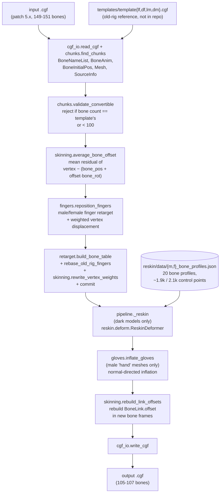

# transform-cgf

`transform-cgf` converts Aion character meshes (CryEngine `.cgf` geometry files) from the skeleton and skinning layout introduced in game patch 5.x back to the layout used by earlier patches. Newer character assets carry a larger skeleton (151 bones for female models, 149 for male) than the old one, use five finger chains per hand instead of three, and share one body shape between both playable races. An older client cannot load them.

The old skeleton's size depends on both race and gender, not gender alone:

| model | old bone count |
|---|---|
| `lf` (light female) | 105 |
| `df` (dark female) | 107 |
| `lm` (light male) | 103 |
| `dm` (dark male) | 105 |

Built as volunteer work for an Aion server, which uses it to bring newer character skins to an older client.

**Stack:** Python 3.10+, [PyFFI](https://github.com/niftools/pyffi) (`pyffi.formats.cgf`), NumPy.

## Install

```bash
pip install -e .
```

PyFFI is the awkward dependency: its last PyPI release predates Python 3.10 and its `setup.py` no longer builds, so it is not listed in `pyproject.toml` and has to be installed from source:

```bash
git clone https://github.com/niftools/pyffi.git
cp -r pyffi/pyffi "$(python -c 'import site; print(site.getsitepackages()[0])')/"
```

It is pure Python, so copying the package directory is enough.

## Templates

The conversion needs an old-rig **template** per model: `templatelf.cgf`, `templatedf.cgf`, `templatelm.cgf`, `templatedm.cgf`. These are extracted game assets and are **not** shipped with this project. Put them in `./templates/`, pass `--templates DIR`, or set `$TRANSFORM_CGF_TEMPLATES`.

If you do not have one but you do have a mesh from before a conversion and the same mesh after it, `tools/rebuild_template.py` can reconstruct the template from that pair — the conversion is invertible for exactly the bone data a template supplies. See the script's docstring for how.

## Usage

### Command line

```bash
transform-cgf DMCH_cash_S8EV_Hand.cgf --model dm
transform-cgf mesh/ --model dm --output converted/ --keep-going
python -m transform_cgf --help
```

| Option | Description |
|---|---|
| `INPUT...` | One or more `.cgf` files; a directory is searched recursively |
| `-m`, `--model` | `lf`, `df`, `lm` or `dm` — race letter then gender letter |
| `-o`, `--output` | Output directory, or an exact `.cgf` path for a single input. Default: a `transform_output/` beside each input |
| `-t`, `--templates` | Where the old-rig templates live. Default: `./templates` |
| `-k`, `--keep-going` | Carry on after a file that cannot be converted |
| `-v`, `--verbose` | Log each stage |

Exit status is `0` on success, `1` if a file failed, `2` for a usage problem. A file that is already in the old format is *skipped*, not failed, so pointing the tool at a directory twice is harmless.

### Python

```python
from transform_cgf import transform_cgf

result = transform_cgf("DMCH_cash_S8EV_Hand.cgf", model="dm")
print(result.output_path, result.target_bone_count)
```

| Argument | Type | Default | Description |
|---|---|---|---|
| `input` | `str \| Path` | — | The `.cgf` to convert |
| `output` | `str \| Path \| None` | `None` | Output directory, or an exact `.cgf` path. Default: `transform_output/` beside the input |
| `input_folder` | `str \| Path \| None` | `None` | Directory holding `input`; joined as a path, so a trailing separator is optional |
| `model` | `"lf" \| "df" \| "lm" \| "dm"` | `"lm"` | Target model code |
| `template_dir` | `str \| Path \| None` | `None` | Where to find templates |

Every failure raises a subclass of `TransformCgfError`, so a batch job can catch that one type:

```python
from transform_cgf import TransformCgfError, UnsupportedModelError

try:
    transform_cgf(path, model="dm")
except UnsupportedModelError:
    pass            # already old-format, or not a character mesh
except TransformCgfError as exc:
    log.error("%s: %s", path, exc)
```

## How it works


```mermaid
flowchart TD
    IN["input .cgf<br/>(patch 5.x, 149-151 bones)"] --> READ
    TPL["templates/template{lf,df,lm,dm}.cgf<br/>(old-rig reference, not in repo)"] --> READ
    READ["cgf_io.read_cgf + chunks.find_chunks<br/>BoneNameList, BoneAnim,<br/>BoneInitialPos, Mesh, SourceInfo"] --> VAL
    VAL["chunks.validate_convertible<br/>reject if bone count == template's<br/>or &lt; 100"] --> OFF
    OFF["skinning.average_bone_offset<br/>mean residual of<br/>vertex − (bone_pos + offset·bone_rot)"] --> FING
    FING["fingers.reposition_fingers<br/>male/female finger retarget<br/>+ weighted vertex displacement"] --> XF
    XF["retarget.build_bone_table<br/>+ rebase_old_rig_fingers<br/>+ skinning.rewrite_vertex_weights<br/>+ commit"] --> RS
    RS["pipeline._reskin<br/>(dark models only)<br/>reskin.deform.ReskinDeformer"] --> GL
    PROF[("reskin/data/{m,f}_bone_profiles.json<br/>20 bone profiles,<br/>~1.9k / 2.1k control points")] --> RS
    GL["gloves.inflate_gloves<br/>(male 'hand' meshes only)<br/>normal-directed inflation"] --> LNK
    LNK["skinning.rebuild_link_offsets<br/>rebuild BoneLink.offset<br/>in new bone frames"] --> W
    W["cgf_io.write_cgf"] --> OUT["output .cgf<br/>(105-107 bones)"]
```

Model codes are two characters, race then gender, matching Aion's asset prefixes (`LF`, `DF`, `LM`, `DM`). The race letter decides whether the body reskin runs; the gender letter selects the template, the finger retarget path and the reskin profiles.

## Layout

```
src/transform_cgf/
├── __init__.py          public API: transform_cgf()
├── cli.py               argparse front end
├── pipeline.py          the stages, in order
├── model.py             the lf/df/lm/dm code as a value object
├── errors.py            one exception hierarchy
├── math3d.py            rotation helpers on PyFFI's Matrix33/Vector3
├── cgf_io.py            read/write, path resolution, template lookup
├── chunks.py            chunk discovery, the skeleton view, validation
├── bone_maps.py         new-rig -> old-rig lookup tables (data)
├── finger_chains.py     chain definitions and per-finger tuning (data)
├── fingers.py           five-finger -> three-finger retarget
├── retarget.py          bone table rebuild
├── skinning.py          the eight weight passes, and bone offsets
├── gloves.py            male glove inflation
└── reskin/
    ├── profiles.py      control-point data and loading
    ├── deform.py        the displacement field
    └── data/*.json      generated profiles (checked in)

tools/
├── build_bone_profiles.py   regenerate reskin/data/*.json
├── rebuild_template.py      recover a template from a before/after pair
├── reference/{old,new}/     16 reference meshes (ground truth)
└── points/*.json            hand-authored point lists
```

**Do not modify the reference `.cgf` files under `tools/reference/`.** These sixteen files are the ground truth the whole reskin depends on. Editing, re-exporting or even re-saving one of them would shift vertex positions and break the deformation field.

## Tests

```bash
pip install -e ".[dev]"
pytest                    # 380 tests, ~2 minutes
pytest -m "not slow"      # ~40 seconds, skips full conversions
```

`tests/test_golden.py` is the important one: it converts three real meshes and checks the result against conversions recorded before the refactor. With the client's own templates in `./templates/` it asserts **byte-for-byte** equality; with a reconstructed template (see `tools/rebuild_template.py`) it falls back to comparing bone names, bone poses, vertex positions, skin weights and link offsets within float32 precision.

The fixtures live in `tests/data/` and are game assets — see the README there. Every test that needs them, or needs a template, skips itself when it is absent, so the suite still runs in a bare checkout.

One fixture is pinned as stale: `output_Body.cgf` was recorded by an earlier build and differs from current output by two bytes, with all geometry bit-identical. The pre-refactor code does not reproduce it either. See `STALE_FIXTURES` in `tests/test_golden.py` for how to clear it.

## Known quirks

Two things in `bone_maps.py` are inherited, harmless today, and pinned by tests so that changing them has to be deliberate:

- The left and right hands are mapped asymmetrically for the ring finger (`Bip01 L Finger31` → `Bip01 L Finger21`, but `Bip01 R Finger31` → `Bip01 R Finger2`). Every finger bone takes its rest pose from the template regardless, and no vertex survives the weight passes still pointing at a middle phalanx, so this does not reach the output.
- Every `Sub_L_bone_skin*` entry in the *vertex fallback* table points at `R_Sup`, a copy-paste from the right-hand block. It is unreachable because those bones survive the retarget and the fallback is only consulted for bones that do not.

See `tests/test_bone_maps.py` for the details.

## License

MIT — see [LICENSE](LICENSE). Copyright (c) 2026 Kuivalainen.

The `.cgf` files under `tools/reference/` and `tests/data/` are game assets included as geometric reference and regression data, and are not covered by that grant.
